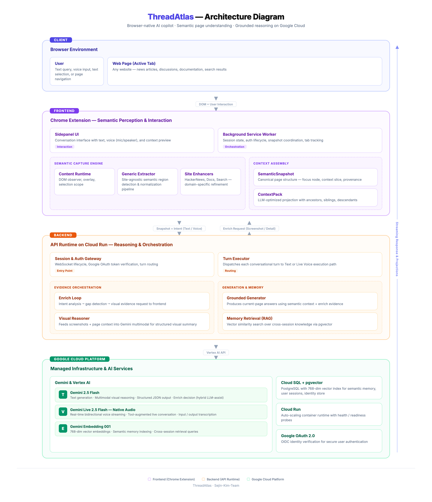

# ThreadAtlas

**A browser-based AI agent that perceives the semantic structure of the current webpage.**

LLMs are powerful, but they struggle to understand webpages the way humans do. When reading complex discussions on sites like Hacker News or Reddit, users naturally follow nested replies, track relationships between comments, and navigate across context. But when an AI agent receives the same page, it usually sees only flattened DOM text — the relational structure is lost.

ThreadAtlas was built to explore a different approach: instead of sending raw text to a model, it captures a **semantic snapshot** of the current page and lets the AI agent reason with that structure intact.

### Demo

[](https://youtu.be/cW-q2XHA3Ng?si=Y3gz3LsB9slz_YD-)

---

## What It Does

ThreadAtlas is a Chrome extension + backend system that allows users to have a grounded conversation with an AI agent about the webpage they're currently viewing.

**Semantic Snapshot Capture** — The extension extracts meaningful structure from the DOM: threads, comments, authors, reply chains, and content relationships. The agent receives this structured representation instead of raw HTML.

**Conversational Side Panel** — Users interact with the agent through a browser side panel. Ask questions about the page, and the agent responds with awareness of the page's structure — not just its text.

**Semantic Selection** — Users can narrow the agent's focus to a specific part of the page. Select a comment thread or section, and the agent's reasoning is scoped to that subtree.

**Live Voice Interaction** — Speak naturally with the agent via Gemini Live while it stays grounded in the current page context. The agent can highlight comments, scroll to relevant nodes, and project structured responses in real time.

**Session Memory with RAG** — The agent remembers past pages and conversations. It can recall related discussions from previous sessions and compare arguments across threads.

---

## How It Works



### Browser Perception Layer (Chrome Extension)

The extension observes the current webpage and extracts a semantic snapshot from the DOM. On discussion pages, this preserves threads, comments, authors, and reply relationships. Users can also activate semantic selection to focus the agent on a specific subtree.

### Agent Runtime (Backend API)

A Node.js/Express backend manages the session and tool orchestration over WebSocket. During a conversation turn, the backend can request additional browser-side evidence — such as screenshots or node-level details — when it needs more context. The agent autonomously decides when to use tools like `context.enrich`, `focus.node`, `present.content`, or `navigate.url`.

### Gemini Live Integration

The agent uses **Gemini through the Google GenAI SDK**, including **Gemini Live** for real-time voice interaction. The backend runs on **Google Cloud Run**, with **Cloud SQL + pgvector** for session memory and **Vertex AI embeddings** for retrieval.

---

## Example Interactions

| Scenario | What Happens |
|----------|-------------|
| "What's the main argument in this thread?" | Agent summarizes the page's claim structure using the semantic snapshot — no tool calls needed |
| "What's the context of this comment?" | Agent identifies the comment from the viewport, looks up its position in the argument tree, highlights it, and explains |
| "What's the weakest evidence for this claim?" | Agent runs deep analysis on the claim's supporting comments and rebuttals, then scrolls to the most relevant counter-argument |
| "I've seen this argument before, remember?" | Agent searches session memory, finds a related past thread, compares the two arguments, and shows a side-by-side view |
| User interrupts mid-response | Agent stops immediately, records what was already delivered, and resumes from the new request without repeating itself |

---

## Tech Stack

| Layer | Technologies |
|-------|-------------|
| Extension | Chrome Extension (Manifest V3), TypeScript, `@mozilla/readability`, `dom-to-semantic-markdown` |
| Backend | Node.js, Express, WebSocket (`ws`), TypeScript |
| AI | Google GenAI SDK, Gemini Live, Vertex AI Embeddings |
| Database | PostgreSQL + pgvector (768-dim vectors) |
| Infra | Docker, Google Cloud Run, Cloud SQL |
| Monorepo | pnpm workspaces, Turborepo, esbuild |

---

## Workspace Layout

```
apps/api/          — Session runtime API (Express + WebSocket)
apps/extension/    — Chrome Extension (side panel, content scripts, semantic extractor)
packages/shared/   — Shared types, constants, and utilities
docs/              — Architecture diagrams and internal specs
```

---

## Getting Started

### Prerequisites

- Node.js 20+
- pnpm 10+

### Install & Build

```bash
pnpm install
pnpm -w build
```

### Run Tests

```bash
pnpm -w test
```

---

## Chrome Extension Setup

1. Build the extension:

```bash
pnpm extension:build
```

2. Open `chrome://extensions`, enable **Developer mode**, click **Load unpacked**, and select `apps/extension/dist`

3. Open a page (e.g., a Hacker News discussion) and click the ThreadAtlas toolbar icon to open the side panel

4. Configure authentication in the sidepanel DevTools console:

**Option A: Local dev bootstrap**

```js
await chrome.storage.local.set({
  THREADATLAS_API_BASE_URL: "http://localhost:8080",
  THREADATLAS_AUTH_GRANT_TYPE: "dev-bootstrap",
  THREADATLAS_BOOTSTRAP_SUBJECT: "local-dev-user-1",
  THREADATLAS_AUTH_BOOTSTRAP_KEY: "<your-bootstrap-key>",
  THREADATLAS_AUTH_DISPLAY_NAME: "Local Dev",
  THREADATLAS_AUTH_PRIMARY_EMAIL: "local-dev@example.com"
})
location.reload()
```

**Option B: Google OAuth**

```js
await chrome.storage.local.set({
  THREADATLAS_API_BASE_URL: "http://localhost:8080",
  THREADATLAS_GOOGLE_OAUTH_CLIENT_ID: "<your-google-oauth-client-id>"
})
location.reload()
```

5. Use the extension (see [Usage Guide](#usage-guide) below)

---

## Usage Guide

### 1. Open the Side Panel

Click the ThreadAtlas icon in the Chrome toolbar. A popup appears with **"Open Assistant"** — click it to open the side panel on the right side of your browser.

The side panel shows the current page's title and a status pill:
- **Preparing** (yellow) — Extension is initializing
- **Ready** (green) — Ready for interaction
- **Unavailable** (gray) — Page cannot be analyzed

### 2. Sign In

If using Google OAuth, click **"Continue with Google"** in the side panel. A Google sign-in dialog will appear. After authentication, you'll see your name and avatar in the menu.

### 3. Capture a Semantic Snapshot

Press `Alt+Shift+C` (or right-click → **Capture Semantic Snapshot**) to capture the current page's semantic structure.

**Visual feedback:**
- A green border flashes around the captured region
- A toast notification appears in the top-right corner: *"Snapshot captured"*
- The snapshot is also copied to your clipboard as JSON

The agent now has a structured understanding of the page — not just the raw text, but threads, comments, authors, and reply relationships.

### 4. Ask Questions (Text)

Type a question in the composer at the bottom of the side panel and press **Enter** (or click the send button).

Example questions:
- *"What are the main arguments in this thread?"*
- *"What's the context of the comment I'm looking at?"*
- *"Which evidence is the weakest for this claim?"*

The agent responds with awareness of the page structure. Responses may include:
- Markdown-formatted text in the conversation area
- **Provenance badges** like *"Based on this page"* or *"Used image context"*
- **Action buttons** — Highlight, Show context, Copy

### 5. Ask Questions (Voice)

**Hold-to-talk:** Press and hold the **Mic button** (or hold `Space` / `Alt+Space` anywhere in the side panel).

- While holding: the live activity strip shows an animated waveform, and your speech is transcribed in real time
- **Release** to send your message
- **Press `Esc`** to cancel

Toggle **voice output** on/off from the menu (three-dot icon) to have the agent speak responses aloud.

### 6. Use Semantic Selection

Press `Alt+Shift+S` to enter selection mode. This lets you narrow the agent's focus to a specific part of the page.

**In selection mode:**
- **Hover** over page elements — a blue overlay highlights the current element, green highlights its parent
- **Click** an element to select it — it turns orange to confirm selection
- The side panel's scope chip changes from *"This page"* to *"Selected text"*, showing a preview of the selected content

Now when you ask a question, the agent's reasoning is scoped to your selection instead of the entire page.

Press `Alt+Shift+S` again or `Esc` to exit selection mode. Click the **X** on the scope chip to clear the selection.

### Keyboard Shortcuts

| Shortcut | Action |
|----------|--------|
| `Alt+Shift+C` | Capture semantic snapshot |
| `Alt+Shift+S` | Toggle semantic selection mode |
| `Space` (hold) | Hold-to-talk voice input |
| `Enter` | Send text message |
| `Shift+Enter` | New line in text input |
| `Esc` | Cancel voice input / exit selection mode |

---

## Backend: Local Development

### Prerequisites

- Docker Desktop (or Docker Engine with Compose plugin)
- Google Cloud CLI (`gcloud`) for Vertex AI authentication

### 1. Set Up Environment Variables

```bash
export GOOGLE_CLOUD_PROJECT=<your-gcp-project-id>
export GOOGLE_CLOUD_LOCATION=<your-gcp-region>
export GOOGLE_APPLICATION_CREDENTIALS_HOST="$HOME/.config/gcloud/application_default_credentials.json"
export POSTGRES_USER=<your-db-user>       # default: testuser
export POSTGRES_PASSWORD=<your-db-password> # default: testpassword
```

If you haven't generated ADC credentials yet:

```bash
gcloud auth application-default login
```

### 2. Start the Services

```bash
docker compose -f docker-compose.yml -f docker-compose.gcp-local.yml up --build api
```

This starts PostgreSQL with pgvector and the API server. The API will be available at `http://localhost:8080`.

### 3. Verify

```bash
curl http://localhost:8080/health
# {"ok":true}

curl http://localhost:8080/ready
# {"ok":true,"checks":{"db":"up"}}
```

### 4. Get an Authentication Token

```bash
curl -X POST http://localhost:8080/api/token \
  -H 'Content-Type: application/json' \
  -H 'X-Bootstrap-Key: <your-bootstrap-key>' \
  -d '{
    "grantType": "dev-bootstrap",
    "bootstrapSubject": "local-dev-user-1",
    "profile": {
      "displayName": "Local Dev",
      "primaryEmail": "local-dev@example.com"
    }
  }'
```

### 5. Shut Down

```bash
docker compose down       # stop services
docker compose down -v    # stop and remove database volume
```

---

## Backend: Cloud Deployment

### 1. Create Cloud SQL Instance

1. Create a PostgreSQL instance in Google Cloud Console
2. Install pgvector: `CREATE EXTENSION IF NOT EXISTS vector;`
3. Run migrations in order:

```bash
for f in apps/api/src/db/migrations/001_auth_core.sql \
         apps/api/src/db/migrations/002_memory_owner_fk.sql \
         apps/api/src/db/migrations/003_auth_identity_provider_bootstrap.sql \
         apps/api/src/db/migrations/003_rag_core.sql; do
  echo "Running $f ..."
  psql -h <cloud-sql-ip> -U postgres -d thread-atlas < "$f"
done
```

### 2. Create Cloud Run Service

1. Go to Cloud Run and create a new service with **Continuously deploy from a repository**
2. Select Dockerfile at `/Dockerfile`, set port to `8080`
3. Set environment variables:

| Variable | Value |
|----------|-------|
| `GOOGLE_CLOUD_PROJECT` | Your GCP project ID |
| `GOOGLE_CLOUD_LOCATION` | Region (e.g., `us-central1`) |
| `DB_CONNECTION_MODE` | `cloudsql-connector` |
| `CLOUD_SQL_INSTANCE_CONNECTION_NAME` | Your instance connection name |
| `DB_NAME` | `thread-atlas` |
| `DB_USER` | Your database user |
| `DB_IAM_AUTHN` | `true` (if using IAM auth) |
| `NODE_ENV` | `production` |
| `GOOGLE_OAUTH_CLIENT_ID` | Your OAuth client ID |
| `AUTH_BOOTSTRAP_KEY` | Secure random string (optional) |

### 3. Verify Deployment

```bash
curl https://your-service-url/health
# {"ok":true}
```

---

## Runtime Notes

- Semantic snapshot capture works without the backend server
- Text/voice conversation requires the backend API
- Canonical runtime path: `POST /api/token` then `GET /ws/session` (WebSocket)
- Database migrations run automatically on API startup

---

## Documentation

- [`docs/internals/PRD.md`](docs/internals/PRD.md) — Product requirements
- [`docs/internals/BE-SPEC.md`](docs/internals/BE-SPEC.md) — Backend specification
- [`docs/internals/FE-SPEC.md`](docs/internals/FE-SPEC.md) — Frontend specification
- [`docs/internals/SCENARIO.md`](docs/internals/SCENARIO.md) — Interaction scenario playbook
