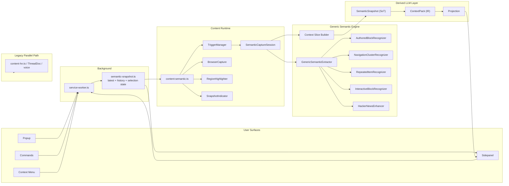
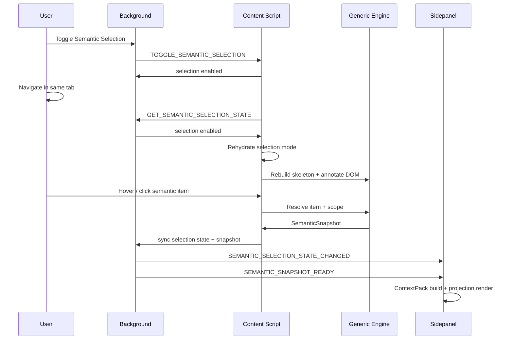

# Frontend Architecture Report

> 범위: Chrome extension 기반 semantic runtime의 현재 아키텍처
> 기준 상태: FE-SPRINT-5 완료 시점
> 목적: 현재 구조를 운영 관점에서 설명하고, 이후 스프린트의 변경 기준점을 남긴다.

---

## 1. Executive Summary

현재 frontend semantic runtime의 중심은 다음 단일 파이프라인이다.

```text
DOM -> SemanticSnapshot (SoT) -> ContextPack (IR) -> Projection
```

이 구조에서 핵심 원칙은 세 가지다.

1. `SemanticSnapshot`이 source of truth다.
2. semantic capture는 `GenericSemanticExtractor` 단일 경로를 사용한다.
3. LLM 입력은 snapshot을 직접 가공하지 않고 반드시 `ContextPack`을 거친다.

이전의 HN 전용 semantic extractor 구조는 제거되었고, 현재는 generic primitive 기반 인식기가 주축이다. Hacker News는 예외 경로가 아니라 generic extraction 결과 위에 얹히는 `HackerNewsEnhancer`로만 보정된다.

동시에 기존 `ThreadDoc` / voice 경로는 아직 병렬로 유지된다. 즉 현재 구조는 완전 단일화가 아니라, `semantic runtime`과 `legacy voice runtime`이 공존하는 단계다.

---

## 2. Goals and Non-Goals

### Goals

1. 웹 페이지를 semantic primitive 단위로 구조화한다.
2. 사용자가 현재 보고 있는 semantic item 또는 semantic subtree를 선택할 수 있게 한다.
3. 선택된 범위만 기준으로 compact semantic snapshot을 만든다.
4. snapshot에서 LLM 소비 전용 중간 IR과 projection을 안정적으로 만든다.
5. 사이트 전용 extractor 없이도 article, discussion, navigation, repeated item, interactive controls를 generic하게 다룬다.

### Non-Goals

1. semantic runtime이 legacy voice path를 대체하는 것은 아직 목표가 아니다.
2. provider/backend wire contract는 이 레이어의 책임이 아니다.
3. site-specific enhancer는 generic extractor를 대체하지 않는다.
4. sidepanel은 snapshot inspection과 LLM context preview까지 담당하지만, cross-page workspace는 아직 범위 밖이다.

---

## 3. Architectural Principles

### 3.1 SemanticSnapshot Is the SoT

브라우저에서 추출한 의미론적 구조의 기준점은 `SemanticSnapshot` 하나다. sidepanel, popup, projection, LLM context preview는 모두 이 snapshot에서만 파생된다.

관련 계약:
- [semantic-snapshot.ts](/Users/eggp/dev/workspace/eggp/thread-atlas/packages/shared/src/types/semantic-snapshot.ts)

### 3.2 ContextPack Is a Derived IR, Not a Second SoT

`ContextPack`은 LLM 소비를 위한 canonical derived layer다. snapshot의 저장 기준을 바꾸지 않고, 모델 친화적인 grouping과 projection을 안정적으로 제공한다.

관련 계약/유틸:
- [context-pack.ts](/Users/eggp/dev/workspace/eggp/thread-atlas/packages/shared/src/types/context-pack.ts)
- [context-pack.ts](/Users/eggp/dev/workspace/eggp/thread-atlas/packages/shared/src/utils/context-pack.ts)

### 3.3 Generic First, Site Enhancement Second

semantic capture path는 `GenericSemanticExtractor`가 단일 주력 경로다. site-specific 품질 보정은 optional enhancer에서만 수행한다.

관련 코드:
- [generic-semantic-extractor.ts](/Users/eggp/dev/workspace/eggp/thread-atlas/apps/extension/src/content/semantic/generic-semantic-extractor.ts)
- [semantic-enhancer.ts](/Users/eggp/dev/workspace/eggp/thread-atlas/packages/shared/src/types/semantic-enhancer.ts)
- [hacker-news-enhancer.ts](/Users/eggp/dev/workspace/eggp/thread-atlas/apps/extension/src/content/semantic/hacker-news-enhancer.ts)

### 3.4 Selection Is Item-Centric, Not Region-Centric

사용자가 실제로 상호작용하는 대상은 region root가 아니라 `가장 작은 selectable item`이다. highlight와 selection도 이 원칙을 따른다.

예:
- nested repeated-item: 개별 item 선택 + branch scope 계산
- article: nearest section/block 선택
- interactive-block: 개별 control 선택 + cluster scope 계산

---

## 4. System Layers

현재 구조는 크게 여섯 개 레이어로 나뉜다.

### 4.1 Shared Contract Layer

shared 패키지는 semantic runtime 전체가 공유하는 타입과 순수 유틸을 제공한다.

주요 파일:
- [semantic-snapshot.ts](/Users/eggp/dev/workspace/eggp/thread-atlas/packages/shared/src/types/semantic-snapshot.ts)
- [context-pack.ts](/Users/eggp/dev/workspace/eggp/thread-atlas/packages/shared/src/types/context-pack.ts)
- [semantic-enhancer.ts](/Users/eggp/dev/workspace/eggp/thread-atlas/packages/shared/src/types/semantic-enhancer.ts)
- [messages.ts](/Users/eggp/dev/workspace/eggp/thread-atlas/packages/shared/src/types/messages.ts)
- [context-pack.ts](/Users/eggp/dev/workspace/eggp/thread-atlas/packages/shared/src/utils/context-pack.ts)

### 4.2 Content Runtime Layer

content runtime은 실제 웹 페이지 안에서 semantic extraction, selection mode, overlay rendering, snapshot capture를 수행한다.

주요 파일:
- [content-semantic.ts](/Users/eggp/dev/workspace/eggp/thread-atlas/apps/extension/src/content/content-semantic.ts)
- [TriggerManager.ts](/Users/eggp/dev/workspace/eggp/thread-atlas/apps/extension/src/content/capture/TriggerManager.ts)
- [BrowserCapture.ts](/Users/eggp/dev/workspace/eggp/thread-atlas/apps/extension/src/content/capture/BrowserCapture.ts)
- [RegionHighlighter.ts](/Users/eggp/dev/workspace/eggp/thread-atlas/apps/extension/src/content/overlay/RegionHighlighter.ts)
- [SnapshotIndicator.ts](/Users/eggp/dev/workspace/eggp/thread-atlas/apps/extension/src/content/overlay/SnapshotIndicator.ts)

### 4.3 Generic Semantic Engine

generic engine은 primitive recognizer, skeleton/session orchestration, context slice 계산, enhancer 적용을 담당한다.

주요 파일:
- [session.ts](/Users/eggp/dev/workspace/eggp/thread-atlas/apps/extension/src/content/semantic/session.ts)
- [generic-semantic-extractor.ts](/Users/eggp/dev/workspace/eggp/thread-atlas/apps/extension/src/content/semantic/generic-semantic-extractor.ts)
- [context-slice.ts](/Users/eggp/dev/workspace/eggp/thread-atlas/apps/extension/src/content/semantic/context-slice.ts)
- [signals.ts](/Users/eggp/dev/workspace/eggp/thread-atlas/apps/extension/src/content/semantic/signals.ts)
- [skeleton-builder.ts](/Users/eggp/dev/workspace/eggp/thread-atlas/apps/extension/src/content/semantic/skeleton-builder.ts)
- [skeleton-manager.ts](/Users/eggp/dev/workspace/eggp/thread-atlas/apps/extension/src/content/semantic/skeleton-manager.ts)

### 4.4 Background Coordination Layer

background는 탭 단위 state coordinator 역할을 맡는다.

책임:
- latest snapshot 유지
- snapshot history 유지
- selection mode state 유지
- content script / sidepanel / popup 간 fan-out 조정

주요 파일:
- [service-worker.ts](/Users/eggp/dev/workspace/eggp/thread-atlas/apps/extension/src/background/service-worker.ts)
- [semantic-snapshot.ts](/Users/eggp/dev/workspace/eggp/thread-atlas/apps/extension/src/background/semantic-snapshot.ts)

### 4.5 UI Layer

popup과 sidepanel은 동일한 semantic runtime state를 다른 수준의 affordance로 노출한다.

주요 파일:
- [popup/index.ts](/Users/eggp/dev/workspace/eggp/thread-atlas/apps/extension/src/popup/index.ts)
- [sidepanel/index.ts](/Users/eggp/dev/workspace/eggp/thread-atlas/apps/extension/src/sidepanel/index.ts)
- [sidepanel/ui.ts](/Users/eggp/dev/workspace/eggp/thread-atlas/apps/extension/src/sidepanel/ui.ts)
- [sidepanel.html](/Users/eggp/dev/workspace/eggp/thread-atlas/apps/extension/sidepanel.html)

### 4.6 Legacy Parallel Path

legacy HN voice path는 semantic runtime과 별개로 유지되고 있다.

관련 파일:
- [content-hn.ts](/Users/eggp/dev/workspace/eggp/thread-atlas/apps/extension/src/content/content-hn.ts)

이 경로는 `ThreadDoc` / voice capture를 위한 것이며, semantic snapshot runtime의 input/output과 섞이지 않는다.

---

## 5. Runtime Component Diagram



---

## 6. Capture Sequence

selection mode가 켜져 있을 때 사용자가 semantic item을 선택하고, snapshot이 만들어지고, sidepanel에 LLM Context가 갱신되는 표준 시퀀스는 아래와 같다.



이 시퀀스에서 중요한 점은 selection mode가 navigation 이후에도 다시 hydrate된다는 것이다. 최근 수정 이후 같은 탭에서 링크로 이동해도 selection mode를 껐다 켤 필요가 없다.

---

## 7. Core Data Model

### 7.1 SemanticSnapshot

`SemanticSnapshot`은 capture 시점의 semantic state를 기록한다.

핵심 필드:
- `page`
- `focus`
- `context`
- `meta`
- `meta.coverage`

coverage는 현재 snapshot이 전체 페이지 중 어느 범위를 대표하는지 설명한다.

예:
- nested repeated-item -> `focus-branch`
- flat/grid repeated-item -> `focus-section`
- authored-block -> `focus-section`
- interactive-block -> `focus-section`

### 7.2 ContextPack

`ContextPack`은 snapshot을 모델 친화적인 그룹 구조로 재배열한 중간 IR이다.

고정 그룹:
- `ancestors`
- `focus`
- `descendants`
- `siblings`
- `containers`
- `omitted`

projection은 이 IR을 기반으로만 만든다.

### 7.3 Projection

현재 projection 포맷:
- `context-pack-json`
- `compact-json`
- `linear-text`

sidepanel은 이 세 projection을 로컬에서 즉시 계산한다.

### 7.4 InteractiveNode

interactive primitive는 별도 node shape를 가진다.

핵심 필드:
- `controlType`
- `action`
- `state`
- `valuePreview`
- `label`
- `role`
- `options`

privacy-sensitive raw value는 직접 snapshot에 남기지 않고 sanitizer를 거친다.

---

## 8. Generic Primitive Engine

현재 generic engine의 실질 recognizer는 네 종류다.

### 8.1 AuthoredBlockRecognizer

대상:
- article
- main content
- section/block based prose content

전략:
- `Readability` 우선
- semantic AST fallback
- nearest section/block 선택

### 8.2 NavigationClusterRecognizer

대상:
- nav
- breadcrumb
- pagination
- header/footer/aside link cluster

전략:
- link density
- landmark role
- breadcrumb/pagination heuristic

### 8.3 RepeatedItemRecognizer

대상:
- list
- table
- div/card/grid/tree based repeated structure

subtype:
- `flat`
- `nested`
- `grid`

이 recognizer가 현재 discussion, feed, result card, dashboard row의 핵심을 담당한다.

### 8.4 InteractiveBlockRecognizer

대상:
- search controls
- filter controls
- sort controls
- form clusters
- action groups

selection은 cluster root가 아니라 개별 control child를 기준으로 한다.

---

## 9. Site Enhancer Layer

site enhancer는 generic output 위에 얇게 얹히는 post-process 레이어다.

원칙:
- 새 region 생성 금지
- page 전체 재파싱 금지
- snapshot wire shape 변경 금지
- refine만 허용

현재 구현된 enhancer:
- `HackerNewsEnhancer`

책임:
- discussion category refinement
- branch root 보정
- author 기반 display label 보정
- selection label 개선

즉 HN은 extractor가 아니라 enhancer를 가진 special case다.

---

## 10. Selection, Highlight, and Scope

selection mode와 hover/highlight는 semantic runtime UX의 핵심이다.

현재 정책:

1. hover는 가장 작은 selectable item을 찾는다.
2. selection mode가 켜져 있으면 click으로 semantic item을 선택할 수 있다.
3. selected item은 hover보다 우선한다.
4. snapshot capture는 text selection이 없으면 selected item을 기준으로 잡는다.
5. 각 item은 `scopeRootId`를 함께 가진다.

scope 규칙:
- nested repeated-item: item selection + branch scope
- flat/grid repeated-item: item selection + local section scope
- authored-block: nearest section scope
- interactive-block: control selection + cluster scope

현재 overlay는 scroll/resize에 따라 geometry를 다시 계산하므로 화면에 고정된 잔상이 남지 않는다.

---

## 11. Background State Model

background는 탭별 상태를 메모리로 관리한다.

현재 저장 상태:
- latest semantic snapshot
- semantic snapshot history
- semantic selection enabled/disabled
- selected semantic target

역할:
- popup, sidepanel, content script 사이의 state fan-out
- capture 완료 broadcast
- selection state hydrate
- sidepanel initial data 공급

이 구조 덕분에 sidepanel은 페이지 DOM을 직접 읽지 않고도 현재 semantic 상태를 복원할 수 있다.

---

## 12. Sidepanel Responsibilities

sidepanel은 semantic runtime의 운영 콘솔 역할을 한다.

현재 제공 기능:
- current page semantic summary
- selected semantic node detail
- latest semantic snapshot inspection
- snapshot history
- `ContextPack` / `Compact JSON` / `Linear Text` preview
- `Copy Snapshot`
- `Copy LLM Context`

interactive snapshot일 때는 안전성 정책상 `branch-summary`만 허용되고, `reply-assist`와 `claim-extraction`은 비활성화된다.

---

## 13. Current Strengths

### 13.1 Generic Capture Now Works Across Different Page Types

현재 아키텍처는 article, discussion, feed, navigation, interactive control cluster까지 하나의 semantic runtime으로 다룰 수 있다.

### 13.2 HN No Longer Needs a Dedicated Semantic Extractor

HN은 generic repeated-item + enhancer 조합으로 처리되며, semantic pipeline의 예외 구조가 줄었다.

### 13.3 LLM Pipeline Is Cleanly Layered

`SemanticSnapshot -> ContextPack -> Projection` 구조 덕분에 모델 입력 정책과 브라우저 추출 정책이 분리되어 있다.

### 13.4 Selection UX Is Stronger Than Raw Hover Capture

selection mode, item-centric scope, navigation 후 state 복구까지 갖춰서 실제 사용성이 높아졌다.

---

## 14. Current Architectural Debt

현재 구조에서 남아 있는 부채는 네 가지다.

### 14.1 Recognizer Complexity Is Concentrated

[generic-semantic-extractor.ts](/Users/eggp/dev/workspace/eggp/thread-atlas/apps/extension/src/content/semantic/generic-semantic-extractor.ts) 가 여전히 크고 책임이 많다. recognizer별 파일 분리와 heuristic isolation이 더 필요하다.

### 14.2 Site Enhancer Coverage Is Narrow

현재 enhancer는 HN만 있다. docs/search/reddit 계열은 아직 generic baseline에 더 의존한다.

### 14.3 Interactive Projection Policy Is Still Conservative

interactive snapshot은 `branch-summary`만 허용된다. interactive-specific task profile은 아직 없다.

### 14.4 Legacy Parallel Path Still Exists

semantic runtime과 legacy `ThreadDoc` / voice path가 병렬 유지되고 있어 장기적으로는 통합 또는 명확한 경계 재정의가 필요하다.

---

## 15. Recommended Next Priorities

다음 우선순위는 아래 순서가 적절하다.

1. recognizer 품질 튜닝
2. recognizer 파일 분해와 성능 계측
3. `DocsEnhancer` 또는 `SearchEnhancer`
4. interactive projection 정책 확장
5. Reddit support
6. legacy path 정리 전략 수립

현재는 “새 엔진을 만드는 단계”를 넘어섰고, 이제는 `coverage + precision + productization` 단계로 보는 것이 맞다.

---

## 16. Source Index

핵심 진입점:
- [content-semantic.ts](/Users/eggp/dev/workspace/eggp/thread-atlas/apps/extension/src/content/content-semantic.ts)
- [service-worker.ts](/Users/eggp/dev/workspace/eggp/thread-atlas/apps/extension/src/background/service-worker.ts)
- [sidepanel/index.ts](/Users/eggp/dev/workspace/eggp/thread-atlas/apps/extension/src/sidepanel/index.ts)

semantic engine:
- [generic-semantic-extractor.ts](/Users/eggp/dev/workspace/eggp/thread-atlas/apps/extension/src/content/semantic/generic-semantic-extractor.ts)
- [session.ts](/Users/eggp/dev/workspace/eggp/thread-atlas/apps/extension/src/content/semantic/session.ts)
- [context-slice.ts](/Users/eggp/dev/workspace/eggp/thread-atlas/apps/extension/src/content/semantic/context-slice.ts)
- [hacker-news-enhancer.ts](/Users/eggp/dev/workspace/eggp/thread-atlas/apps/extension/src/content/semantic/hacker-news-enhancer.ts)

shared contracts:
- [semantic-snapshot.ts](/Users/eggp/dev/workspace/eggp/thread-atlas/packages/shared/src/types/semantic-snapshot.ts)
- [context-pack.ts](/Users/eggp/dev/workspace/eggp/thread-atlas/packages/shared/src/types/context-pack.ts)
- [semantic-enhancer.ts](/Users/eggp/dev/workspace/eggp/thread-atlas/packages/shared/src/types/semantic-enhancer.ts)
- [context-pack.ts](/Users/eggp/dev/workspace/eggp/thread-atlas/packages/shared/src/utils/context-pack.ts)

UI/runtime UX:
- [TriggerManager.ts](/Users/eggp/dev/workspace/eggp/thread-atlas/apps/extension/src/content/capture/TriggerManager.ts)
- [BrowserCapture.ts](/Users/eggp/dev/workspace/eggp/thread-atlas/apps/extension/src/content/capture/BrowserCapture.ts)
- [RegionHighlighter.ts](/Users/eggp/dev/workspace/eggp/thread-atlas/apps/extension/src/content/overlay/RegionHighlighter.ts)
- [popup/index.ts](/Users/eggp/dev/workspace/eggp/thread-atlas/apps/extension/src/popup/index.ts)
- [ui.ts](/Users/eggp/dev/workspace/eggp/thread-atlas/apps/extension/src/sidepanel/ui.ts)
