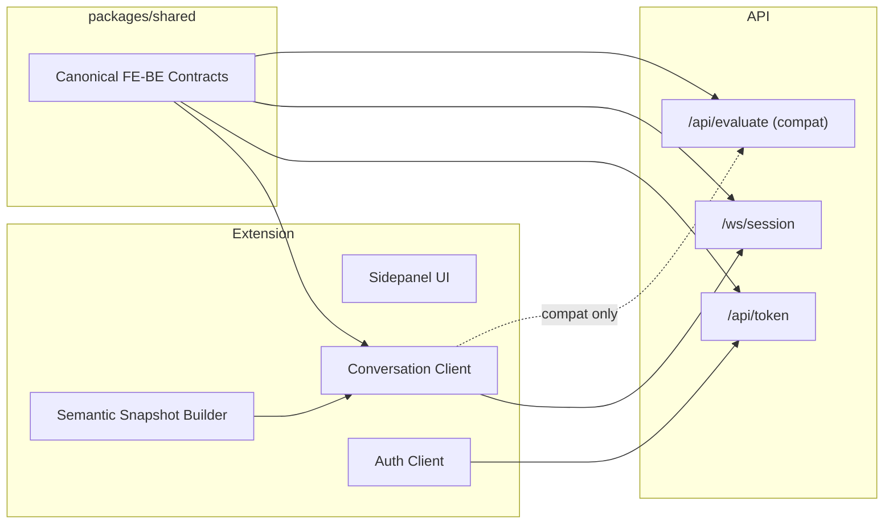

# FE-BE Interface Draft

> 작성 시점: 2026-03-12
> 범위: ThreadAtlas extension과 API 사이의 현재 경계, 목표 경계, 인터페이스 갭
> 목적: FE 관점에서 어떤 경계를 유지하고 어떤 경계를 canonical로 승격할지 정리한다.

---

## 1. Executive Summary

현재 FE와 BE 사이에는 사실상 두 개의 경계가 공존한다.

1. `Legacy Evaluate Boundary`
2. `Canonical Session Boundary`

현재 FE가 실제로 사용 중인 경계는 `Legacy Evaluate Boundary` 다.
반면 BE가 현재 canonical runtime으로 확장하고 있는 경계는 `Canonical Session Boundary` 다.

따라서 지금 상태의 핵심 문제는 기능 부족이 아니라:

- FE의 실제 호출 경계와
- BE의 실제 확장 경계가

서로 다르다는 점이다.

이 문서의 결론은 단순하다.

- `Legacy Evaluate Boundary` 는 호환용 adapter 경계로 유지한다.
- `Canonical Session Boundary` 를 FE-BE 단일 canonical contract로 승격한다.
- token, analyze, session runtime event 타입을 `packages/shared` 로 올린다.
- FE는 transport abstraction 위에서 `SSETransport` 와 `WSTransport` 를 교체 가능하게 만든다.

---

## 2. Boundary Model

### 2.1 Boundary A: Legacy Evaluate Boundary

현재 FE sidepanel이 실제로 사용하는 질의 경계다.

흐름:

```text
Extension
  -> build StateSnapshot
  -> POST /api/evaluate
  -> SSE(projection, done, error)
  -> apply Projection
```

특징:

- request 단위 stateless 호출
- `StateSnapshot` 중심
- `Projection` 중심 응답
- enrich sub-loop, turn lifecycle, session lifecycle 없음
- 현재 FE와 가장 잘 맞는 경계
- BE 문서상 legacy compatibility 경계

현재 주요 계약:

- `StateSnapshot`
- `ConversationContext`
- `Projection`
- `EvaluateRequest`
- `EvaluateDonePayload`
- `EvaluateErrorPayload`

장점:

- FE 구현 단순
- sidepanel 상태 모델과 잘 맞음
- shared 타입이 이미 존재함

한계:

- current-page canonical runtime과 분리됨
- WS 기반 session/turn model과 불일치
- enrich, recall, tab binding, interrupt 같은 장기 기능을 늘리기 어렵다

### 2.2 Boundary B: Canonical Session Boundary

BE가 현재 canonical runtime으로 확장하고 있는 경계다.

흐름:

```text
Extension
  -> POST /api/token
  -> connect /ws/session?token=...
  -> session.open
  -> context.update
  -> snapshot.push
  -> user.intent
  -> progress / projection / turn.done
  -> optional context.enrich.request / context.enrich.result
```

특징:

- session 기반 상태 유지
- tab binding 명시
- snapshot을 turn 단위로 재사용 가능
- interrupt와 enrich를 protocol 수준에서 지원
- current-page runtime의 실제 확장 경계

장점:

- BE runtime 확장 방향과 일치
- enrich/recall/turn ownership 모델을 자연스럽게 담을 수 있음
- FE가 page/session state를 더 정교하게 제어할 수 있음

한계:

- 현재 FE는 이 경계를 아직 사용하지 않음
- 타입이 shared가 아니라 BE 내부에 있음
- FE 상태머신이 session/turn/enrich event를 아직 직접 표현하지 않음

---

## 3. Target Architecture

목표 구조는 다음과 같다.



원칙:

1. FE가 직접 의존하는 canonical contract는 모두 `packages/shared` 에 있어야 한다.
2. `Projection` 은 두 경계 모두에서 재사용 가능해야 한다.
3. `StateSnapshot` 은 FE가 만드는 canonical semantic input으로 유지한다.
4. `Legacy Evaluate Boundary` 는 `Canonical Session Boundary` 로의 이행 bridge 로만 유지한다.

---

## 4. Proposed Contract Ownership

### 4.1 shared로 승격해야 하는 계약

새 파일 후보:

- `packages/shared/src/types/auth-session.ts`
- `packages/shared/src/types/session-runtime.ts`
- `packages/shared/src/types/analyze.ts`

공유해야 하는 이유:

- FE와 BE가 둘 다 import 해야 함
- 테스트 fixture와 mock도 같은 계약을 써야 함
- 현재처럼 BE 내부 타입과 FE 추정 타입이 분리되면 drift가 반복됨

### 4.2 shared에 남겨야 하는 기존 계약

유지:

- `StateSnapshot`
- `Projection`
- `ConversationContext`
- `Intent`
- `SemanticSnapshot`

이유:

- FE가 이미 이 계약들을 중심으로 상태를 만든다
- canonical runtime도 결국 FE semantic snapshot을 기반으로 동작한다

### 4.3 BE 내부에 남겨도 되는 계약

내부 구현 디테일:

- DB persistence row shape
- enrichment decision heuristics
- analysis normalization 내부 계산 구조
- runtime manager 내부 상태 객체

원칙:

- wire contract가 아닌 것만 내부에 둔다

---

## 5. Proposed Canonical Interfaces

아래 타입은 초안이다.
정확한 naming은 조정 가능하지만, shape는 이 수준으로 고정하는 것이 좋다.

### 5.1 Auth Session

```ts
export type TokenGrantType = "dev-bootstrap" | "google-id-token"

export type TokenRequest =
  | {
      grantType: "dev-bootstrap"
      bootstrapSubject: string
      profile?: {
        displayName?: string
        primaryEmail?: string
        avatarUrl?: string
      }
    }
  | {
      grantType: "google-id-token"
      idToken: string
    }

export interface TokenResponse {
  token: string
  expiresAt: number
  user: {
    id: string
    displayName?: string
    primaryEmail?: string
    avatarUrl?: string
  }
}
```

### 5.2 Analyze Boundary

분석 경계는 FE가 명시적으로 사용할지 여부를 먼저 정해야 한다.
사용한다면 shared 타입은 실제 BE contract와 같아야 한다.

```ts
export type AnalyzeMode = "seed" | "memory-candidate" | "visual-summary"

export interface AnalyzeRequest {
  tabId: number
  snapshot: SemanticSnapshot
  mode?: AnalyzeMode
  providedPack?: ContextPack
}

export type AnalyzeResponse =
  | {
      mode: "seed" | "memory-candidate"
      analysisId: string
      normalizedMode: "discussion" | "authored" | "interactive" | "generic"
      summaryCandidates: SummaryCandidate[]
      visualSummaries?: VisualDerivedSummary[]
    }
  | {
      mode: "visual-summary"
      analysisId: string
      normalizedMode: "discussion" | "authored" | "interactive" | "generic"
      visualSummaries: VisualDerivedSummary[]
      summaryCandidates?: SummaryCandidate[]
    }
```

### 5.3 Canonical Session Runtime

#### Client -> Server

```ts
export interface RuntimeEnvelopeBase {
  type: string
  timestamp: string
  requestId?: string
  sessionId?: string
  turnId?: string
}

export type ClientEnvelope =
  | (RuntimeEnvelopeBase & {
      type: "session.open"
      payload: { clientSessionId: string }
    })
  | (RuntimeEnvelopeBase & {
      type: "context.update"
      payload: { tabId: number; isPrimary?: boolean }
    })
  | (RuntimeEnvelopeBase & {
      type: "snapshot.push"
      payload: { tabId: number; snapshot: SnapshotLike }
    })
  | (RuntimeEnvelopeBase & {
      type: "user.intent"
      payload: {
        text: string
        primaryTabId: number
        boundSnapshotCapturedAt: string
      }
    })
  | (RuntimeEnvelopeBase & {
      type: "context.enrich.result"
      payload: ContextEnrichResultPayload
    })
  | (RuntimeEnvelopeBase & {
      type: "interrupt"
      payload: { reason?: string }
    })
```

#### Server -> Client

```ts
export type ServerEnvelope =
  | {
      type: "session.ready"
      timestamp: string
      sessionId: string
      requestId?: string
      payload: {
        sessionId: string
        clientSessionId: string
        reused: boolean
      }
    }
  | {
      type: "progress"
      timestamp: string
      sessionId: string
      turnId: string
      payload: {
        stage: string
        message: string
      }
    }
  | {
      type: "projection"
      timestamp: string
      sessionId: string
      turnId: string
      payload: Projection
    }
  | {
      type: "context.enrich.request"
      timestamp: string
      sessionId: string
      turnId: string
      payload: {
        requestKind: "node-screenshot" | "visible-region" | "node-detail"
        targetRef: Record<string, unknown>
        reason: string
        timeoutMs: number
        visibility?: "status-only"
      }
    }
  | {
      type: "turn.done"
      timestamp: string
      sessionId: string
      turnId: string
      payload: {
        referencedTabIds: number[]
        provenanceSummary: string[]
      }
    }
  | {
      type: "error"
      timestamp: string
      sessionId?: string
      turnId?: string
      requestId?: string
      payload: {
        code:
          | "INVALID_EVENT"
          | "INVALID_SNAPSHOT"
          | "UNAUTHORIZED"
          | "MODEL_CONFIG_MISSING"
          | "GENERATION_FAILED"
        message: string
      }
    }
```

### 5.4 Transport Abstraction in FE

FE 쪽에서는 실제 transport가 SSE인지 WS인지 UI가 몰라야 한다.

```ts
export interface ConversationTransport {
  open(): Promise<void>
  close(): Promise<void>
  sendIntent(input: {
    intent: Intent
    stateSnapshot: StateSnapshot
    selectedSnapshot: SemanticSnapshot | null
  }): Promise<void>
  interrupt(reason?: string): Promise<void>
  onEvent(listener: (event: ServerEnvelope | LegacyEvaluateEvent) => void): () => void
}
```

초기 구현:

- `EvaluateSseTransport`
- `SessionWsTransport`

원칙:

- sidepanel UI는 transport가 아니라 event stream만 본다

---

## 6. Current State vs Target Gap

| 항목 | 현재 상태 | 목표 상태 | 갭 수준 | 메모 |
| --- | --- | --- | --- | --- |
| Conversation transport | FE는 `/api/evaluate` SSE만 사용 | WS session runtime canonical | 높음 | FE transport abstraction 없음 |
| Token request | FE/shared는 오래된 `{ userId }` 가정 | `grantType` 기반 세션 발급 | 높음 | 실제 BE와 불일치 |
| Token response | FE는 `token`, `expiresAt` 만 사실상 기대 | `user` 포함 canonical session response | 중간 | FE user state 확장 가능 |
| Analyze request | shared 타입과 실제 BE 타입 다름 | shared와 BE contract 일치 | 높음 | drift 발생 중 |
| Runtime event types | BE 내부 타입만 존재 | shared canonical event union | 높음 | FE mock/test도 같은 타입 써야 함 |
| Projection | shared로 정리돼 있음 | 그대로 유지 | 낮음 | 가장 안정적인 계약 |
| StateSnapshot | FE가 실제로 canonical 입력 생성 | 그대로 유지 | 낮음 | 현재 구조의 강점 |
| Enrich flow | FE에 protocol-level handling 없음 | `context.enrich.request/result` 지원 | 높음 | session runtime 전환의 핵심 |
| Session lifecycle | FE 상태에 session/turn 개념 약함 | sessionId/turnId 명시 | 중간 | sidepanel state machine 수정 필요 |
| Auth boundary | legacy evaluate 경로는 무인증 성격 | session path는 인증 필수 | 중간 | FE auth bootstrap 흐름 필요 |

---

## 7. FE Impact

### 7.1 FE에서 새로 생겨야 하는 레이어

- `AuthClient`
- `ConversationTransport`
- `SessionRuntimeStore`
- `EnrichCoordinator`

### 7.2 sidepanel state에 추가돼야 하는 개념

- `sessionId`
- `clientSessionId`
- `activeTurnId`
- `phase`
  - `initializing`
  - `ready`
  - `opening-session`
  - `sending-intent`
  - `waiting-enrich`
  - `resuming-turn`
  - `error`
- `pendingEnrichRequest`
- `lastRuntimeError`

### 7.3 FE가 계속 재사용할 수 있는 기존 자산

- semantic snapshot capture
- `StateSnapshot` 조립기
- `Projection` 라우터
- semantic selection / highlight / snapshot history

즉 FE는 semantic capture를 갈아엎을 필요가 없다.
실제 변경 대상은 주로 sidepanel conversation layer다.

---

## 8. Migration Plan

### Phase 1: Contract Extraction

- token/analyze/session runtime 계약을 shared로 이동
- FE와 BE가 같은 타입을 import 하게 변경
- 기존 shared의 오래된 `TokenRequest`, `AnalyzeRequest` 는 제거 또는 deprecated 처리

완료 기준:

- FE와 BE 둘 다 shared canonical contract만 import

### Phase 2: FE Transport Abstraction

- 기존 `callEvaluate` 를 `EvaluateSseTransport` 로 감싼다
- sidepanel은 transport interface만 사용하게 바꾼다

완료 기준:

- sidepanel UI 코드가 `/api/evaluate` 경로를 직접 알지 않음

### Phase 3: Session WS Client

- `/api/token`
- `/ws/session`
- `session.open/context.update/snapshot.push/user.intent`
- `progress/projection/turn.done/context.enrich.request`

를 처리하는 `SessionWsTransport` 구현

완료 기준:

- FE가 WS runtime으로 기본 대화 플로우 수행 가능

### Phase 4: Enrich Integration

- `context.enrich.request` 수신
- viewport/node detail capture
- `context.enrich.result` 반환

완료 기준:

- enrich request를 실제 extension capability와 연결

### Phase 5: Legacy Evaluate Degradation

- `/api/evaluate` 는 fallback 또는 개발용 adapter로만 유지
- 신규 기능은 WS path에만 추가

완료 기준:

- FE 기본 경로가 WS session runtime

---

## 9. Decisions Needed

아직 결정이 필요한 항목:

1. `Analyze Boundary` 를 FE public workflow로 유지할지, 내부 tooling/API로만 둘지
2. token 발급의 기본 경로를 `dev-bootstrap` 으로 둘지 `google-id-token` 으로 둘지
3. FE가 `session.open` 을 sidepanel mount 시점에 열지, 첫 intent 시점에 lazy open 할지
4. `SnapshotLike` 를 FE가 최소 shape로 보낼지, `SemanticSnapshot` 전체를 canonical로 보낼지
5. `/ws/session/events` HTTP bridge 를 테스트/폴리필용으로 유지할지

---

## 10. Recommended Next Move

현재 FE 책임 범위를 기준으로 가장 먼저 해야 할 일은 구현이 아니라 계약 정리다.

우선순위:

1. shared canonical contract 초안 확정
2. FE `ConversationTransport` interface 도입
3. legacy SSE transport를 adapter로 격리
4. 그 다음 WS session transport 구현

이 순서를 지키면 FE는 semantic capture 레이어를 건드리지 않고, conversation layer만 단계적으로 전환할 수 있다.
