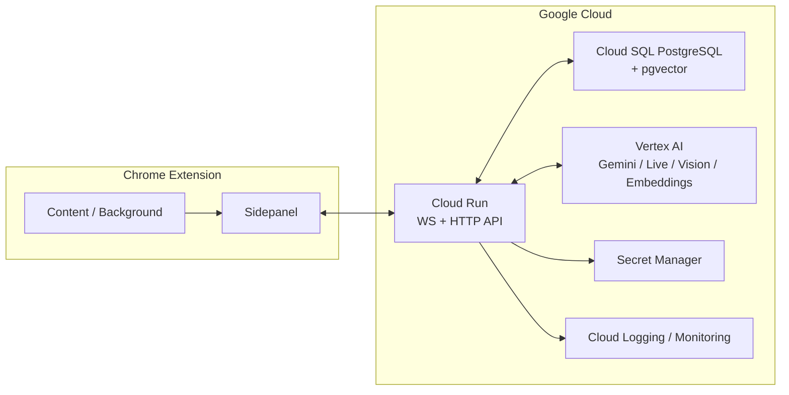
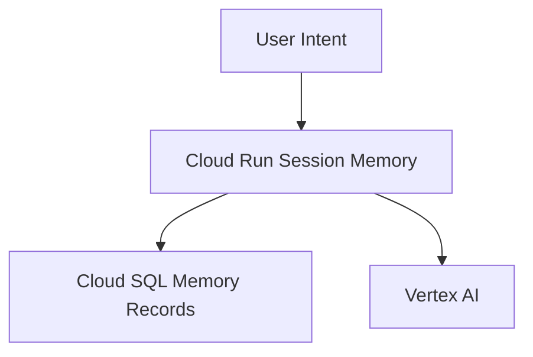

# ThreadAtlas Backend Spec

## Google Cloud Infrastructure

Version: 0.1
Status: Draft
Companion:
- [BE-PRD.md](./BE-PRD.md)
- [BE-SPEC.md](./BE-SPEC.md)
- [BE-SPEC-PROTOCOL.md](./BE-SPEC-PROTOCOL.md)
- [BE-SPEC-MEMORY.md](./BE-SPEC-MEMORY.md)
- [BE-SPEC-RAG-HACKATHON.md](./BE-SPEC-RAG-HACKATHON.md)

---

## 1. Purpose

본 문서는 ThreadAtlas backend를 Google Cloud 위에 배포할 때의 최소 infra 구성을 정의한다.

이 문서가 고정하는 범위:

- v0.1 최소 GCP 서비스 선택
- 각 서비스의 책임
- 세션 상태 / 장기 기억 / 모델 호출의 배치 원칙
- 지금 쓰지 않는 후순위 서비스와 확장 조건

---

## 2. Design Goal

v0.1 infra 목표는 고가용성보다 다음에 있다.

- WebSocket session이 실제로 동작할 것
- long-term memory와 vector retrieval이 동작할 것
- Gemini / Live / Vision / Embeddings를 바로 쓸 수 있을 것
- 운영 복잡도가 해커톤 속도를 방해하지 않을 것

즉, v0.1은 **최소 동작하는 cloud runtime**이 목표다.

---

## 3. Canonical Stack

v0.1 canonical infra stack은 다음으로 고정한다.

1. `Cloud Run`
2. `Cloud SQL for PostgreSQL + pgvector`
3. `Vertex AI`
4. `Secret Manager`
5. `Cloud Logging + Cloud Monitoring`

이 외의 GCP 서비스는 v0.1 필수가 아니다.

---

## 4. Reference Architecture



### 4.1 State Placement



원칙:

- 살아 있는 session state는 초기에는 Cloud Run 메모리에 둔다
- 오래 남길 memory record는 Cloud SQL에 둔다
- reasoning / live / vision / embeddings는 Vertex AI를 사용한다

---

## 5. Service Responsibilities

### 5.1 Cloud Run

역할:

- WebSocket session gateway
- canonical WebSocket endpoint `/ws/session`
- 테스트/디버그용 HTTP ingress adapter `/ws/session/events`
- `/api/token`
- `/api/analyze`
- `/api/ingest/memory`
- `/health` (liveness)
- `/ready` (DB readiness)

선정 이유:

- canonical path가 WebSocket이기 때문
- HTTP companion endpoint를 같은 런타임에서 처리할 수 있기 때문
- GKE보다 운영 복잡도가 낮기 때문

v0.1 운영 원칙:

- 가능한 한 단일 인스턴스에 가깝게 운영한다
- session state는 프로세스 메모리에 둔다
- 인스턴스 재시작 또는 재배치 시 active session 유실 가능성을 감수한다
- reconnect는 지원하되, 완전한 session recovery는 v0.1 필수가 아니다
- `/ws/session/events`는 canonical transport가 아니며 FE 실서비스 경로로 사용하지 않는다
- DB 연결 모드별 필수 env 누락은 `BOOT_CONFIG_ERROR`로 fail-fast 처리한다
- application log는 구조화 JSON line으로 출력하고 Cloud Logging에서 바로 수집 가능한 형식을 유지한다

### 5.2 Cloud SQL for PostgreSQL + pgvector

역할:

- long-term memory record 저장
- provenance / relation metadata 저장
- vector similarity 검색
- accepted memory link의 참조 기반 저장

선정 이유:

- memory model이 단순 chunk store가 아니라 구조화된 record store이기 때문
- metadata filter와 vector similarity를 함께 다뤄야 하기 때문
- `branch-summary`, `section-summary`, `claim-evidence-summary`를 일관되게 저장할 수 있기 때문
- 해커톤 recall이 `recall-card`와 browse metadata를 반환해야 하므로 ownership/provenance/navigation을 함께 보관해야 하기 때문

해커톤 canonical 입장:

- `Cloud SQL for PostgreSQL`은 RAG persistence를 위해 필수다
- `pgvector`는 해커톤 RAG를 실제 semantic recall로 동작시키기 위한 필수 확장이다
- canonical 테이블과 retrieval 규칙은 [BE-SPEC-RAG-HACKATHON.md](./BE-SPEC-RAG-HACKATHON.md)를 따른다
- 로컬 개발의 canonical 연결 경로는 `DATABASE_URL` 기반 direct connection이다
- Cloud Run 배포의 canonical 연결 경로는 `@google-cloud/cloud-sql-connector` 기반 connector profile이다

### 5.2.1 Connection Modes

해커톤 DB 연결은 아래 두 모드로 고정한다.

#### A. `database-url`

용도:

- 로컬 개발
- 로컬 테스트
- 수동 검증

필수 env:

- `DB_CONNECTION_MODE=database-url` 또는 미설정
- `DATABASE_URL`

규칙:

- `DATABASE_URL` 누락 시 부트는 `BOOT_CONFIG_ERROR`로 즉시 실패해야 한다
- 로컬 개발의 canonical 경로는 이 모드다

#### B. `cloudsql-connector`

용도:

- Cloud Run 배포
- Cloud SQL 연결 설정을 사용하는 런타임

필수 env:

- `DB_CONNECTION_MODE=cloudsql-connector`
- `CLOUD_SQL_INSTANCE_CONNECTION_NAME`
- `DB_NAME`
- `DB_USER`

조건부 env:

- `DB_PASSWORD` (`DB_IAM_AUTHN`을 사용하지 않는 경우)
- `DB_IAM_AUTHN=true|false`

규칙:

- Cloud Run 배포의 canonical 경로는 이 모드다
- connector 모드에서 필수 env 누락 시 부트는 `BOOT_CONFIG_ERROR`로 즉시 실패해야 한다
- connector는 `pg`를 대체하지 않고 `pg` 연결 옵션을 생성하는 인프라 어댑터로 사용한다
- connector 모드에서도 query/migration/repository 계층은 동일한 `pg` pool 인터페이스를 사용해야 한다

권장 저장 대상:

- `memory_records`
- `memory_record_embeddings`
- `relation_edges`
- `analysis_runs`

비원칙:

- raw snapshot을 장기 저장의 primary truth로 두지 않는다
- visual-only 결과를 독립 record로 저장하지 않는다

### 5.3 Vertex AI

역할:

- Gemini reasoning
- Gemini Live API
- chart / diagram / visible region 이해
- text embedding 생성

선정 이유:

- 현재 제품 가치가 Gemini 기반 대화/분석과 직접 연결되기 때문
- visual / hybrid selected scenario를 한 레이어에서 처리할 수 있기 때문

권장 사용 분리:

- Live API:
  - 실시간 음성/비전 대화
- 일반 Gemini 호출:
  - summary / relation analysis / explanation
- Embeddings:
  - memory record embedding 생성

구현 원칙:

- 로컬 개발과 GCP 배포가 같은 코드 경로를 타도록 `Vertex AI adapter`를 둔다
- 로컬 개발에서는 `Application Default Credentials (ADC)`를 사용한다
- GCP 배포에서는 `Cloud Run` 서비스 계정으로 인증한다
- API key 전용 분기 구현보다 `project + location + ADC/service account` 경로를 canonical로 둔다
- 제출 기준으로는 Gemini 모델 연동 계층을 `Google GenAI SDK` 또는 `ADK` 기반으로 정렬한다
- embedding 연동 필수 env는 `GOOGLE_CLOUD_PROJECT`, `GOOGLE_CLOUD_LOCATION`으로 고정한다

해커톤 current-page answer generation canonical 규칙:

- 런타임 SDK는 `@google/genai`를 사용한다
- 모델 호출은 `models.generateContent`로 고정한다
- Vertex 초기화는 `project + location` 기반으로만 수행한다
- current-page grounding input은 최소 `snapshot focus text + intent text`를 포함해야 한다
- `GOOGLE_CLOUD_PROJECT` 또는 `GOOGLE_CLOUD_LOCATION` 누락 시 명시적 오류(`MODEL_CONFIG_MISSING`)를 반환한다
- generation 설정은 유효하지만 모델 호출이 실패하면 명시적 오류(`GENERATION_FAILED`)를 반환한다
- optional conservative fallback 모드가 아니면 모델 비정상 상태에서 답변 생성을 시도하지 않는다
- placeholder/stub answer output은 금지한다

해커톤 canonical embedding 설정:

- model: `gemini-embedding-001`
- output dimensionality: `768`
- provider failure 시 pseudo/placeholder vector 대체는 허용하지 않는다

### 5.4 Secret Manager

역할:

- DB 접속 정보
- API key / token
- 기타 runtime secret 관리

원칙:

- 서비스 계정 최소 권한
- secret은 코드나 평문 설정 파일에 두지 않는다

### 5.5 Cloud Logging + Cloud Monitoring

역할:

- session / turn / request 로그 수집
- latency / timeout / error 관측
- WebSocket 장애와 memory ingest 장애 추적

권장 공통 필드:

- `sessionId`
- `turnId`
- `tabId`
- `intentType`
- `retrievalScope`
- `memoryLinkDecision`
- `projectionKind`

구현 원칙:

- application log는 최소 `timestamp`, `level`, `scope`, `event`를 포함해야 한다
- 가능하면 `userId`, `requestId`, `sessionId`, `turnId`를 함께 남긴다
- `bearer token`, `google id_token`, `bootstrap key`, prompt 원문 전문은 로그에 남기지 않는다

---

## 6. Data Placement Rule

| 데이터 | 위치 | 이유 |
| --- | --- | --- |
| active session state | Cloud Run memory | 구현 단순화, 해커톤 우선 |
| active turn state | Cloud Run memory | interrupt / streaming 처리 |
| long-term memory record | Cloud SQL | 구조화된 metadata + provenance |
| vector embedding | Cloud SQL pgvector | record와 가까이 저장 |
| secret | Secret Manager | runtime secret 관리 |
| 로그 / 메트릭 | Cloud Logging / Monitoring | 운영 기본 관측 |

---

## 7. Explicit Non-Goals for v0.1

다음은 v0.1 필수 infra 범위가 아니다.

- `Memorystore for Redis`
- `Cloud Tasks`
- `Cloud Storage`
- `Vertex AI RAG Engine`
- `Pub/Sub`
- `GKE`

이유:

- 먼저 동작하는 session backend와 memory retrieval을 만드는 것이 우선이다
- scale-out과 고급 후처리는 다음 단계로 미룬다

---

## 8. Upgrade Conditions

### 8.1 Redis를 추가하는 시점

아래 중 하나가 생기면 `Memorystore for Redis`를 검토한다.

- Cloud Run 인스턴스를 2개 이상으로 늘려야 할 때
- reconnect 후 session recovery가 중요해질 때
- active turn lock / dedupe / progress buffer를 외부화해야 할 때

### 8.2 Cloud Tasks를 추가하는 시점

아래 중 하나가 생기면 `Cloud Tasks`를 검토한다.

- `/api/analyze` 후처리가 turn latency를 해칠 때
- memory ingest retry가 필요할 때
- visual summary 생성이 비동기 작업으로 분리되어야 할 때

### 8.3 Cloud Storage를 추가하는 시점

아래 중 하나가 생기면 `Cloud Storage`를 검토한다.

- visual artifact 원본 보관이 필요할 때
- replay/debug용 screenshot artifact를 장기 보존해야 할 때

### 8.4 Managed RAG를 재검토하는 시점

아래 중 하나가 생기면 `Vertex AI RAG Engine`을 재검토한다.

- memory corpus가 크게 증가할 때
- custom record store보다 managed retrieval 이점이 커질 때
- multi-corpus retrieval 운영 비용을 줄여야 할 때

---

## 9. Deployment Principle

v0.1 배포 원칙:

- backend runtime은 Cloud Run 하나를 중심으로 시작한다
- DB는 Cloud SQL 단일 primary로 시작한다
- 모델 호출은 Vertex AI에 위임한다
- current-page answer path는 `@google/genai` + `models.generateContent`를 사용한다
- secret은 Secret Manager에서 주입한다

즉, 초기 배포는 다음처럼 이해하면 된다.

```text
Cloud Run
  -> Cloud SQL
  -> Vertex AI
  -> Secret Manager
  -> Logging / Monitoring
```

---

## 10. Rationale Summary

이 구성이 적합한 이유는 세 가지다.

1. 현재 아키텍처의 핵심인 `WebSocket session`을 가장 단순하게 올릴 수 있다.
2. memory model이 구조적이어서 `Cloud SQL + pgvector`가 managed RAG보다 더 자연스럽다.
3. Live / Vision / Embeddings를 모두 `Vertex AI` 한 축으로 처리할 수 있다.

---

## 참고한 공식 문서

- Cloud Run WebSockets: https://docs.cloud.google.com/run/docs/triggering/websockets
- Vertex AI Live API: https://cloud.google.com/vertex-ai/generative-ai/docs/live-api
- Vertex AI Live API WebSockets: https://docs.cloud.google.com/vertex-ai/generative-ai/docs/live-api/get-started-websocket
- Vertex AI text embeddings: https://docs.cloud.google.com/vertex-ai/generative-ai/docs/embeddings/get-text-embeddings
- Cloud SQL for generative AI / pgvector: https://cloud.google.com/sql/docs/postgres/ai-overview
- Cloud SQL vector work: https://cloud.google.com/sql/docs/postgres/work-with-vectors
- Cloud Run secrets: https://docs.cloud.google.com/run/docs/configuring/services/secrets
- Cloud Run Error Reporting: https://docs.cloud.google.com/run/docs/error-reporting
